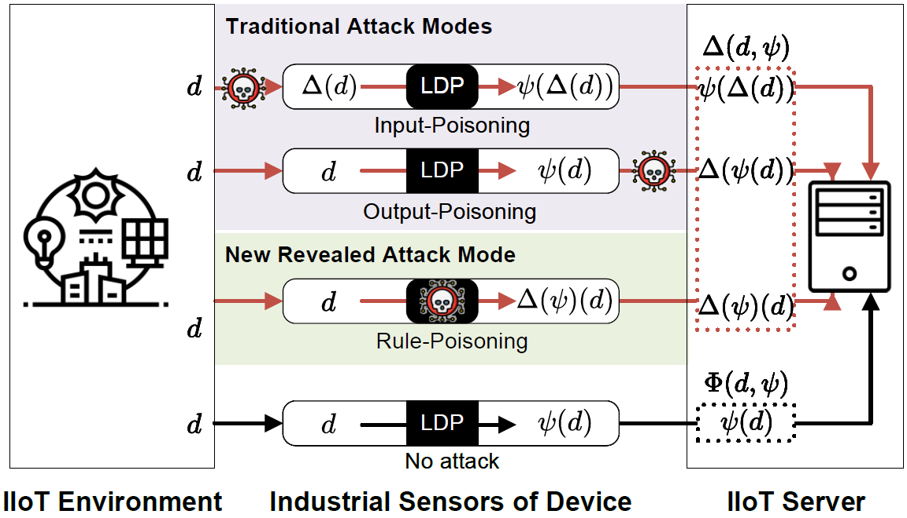

## 实验设计

本文旨在系统评估本地差分隐私（LDP）协议在数据投毒攻击下的鲁棒性，并验证所提PoisonCatcher机制在识别毒化数据项中的有效性。为确保结论的普适性与实用性，实验在合成数据集与真实数据集上进行双重验证。合成数据集基于正态分布生成，包含1,000名用户、20个时间实例的连续与离散属性数据，用以检验方法的泛化能力；真实数据集选用全球天气存储库，涵盖40余项气象特征，验证方法在实际场景中的稳定性。所有数据均经过标准化与独热编码预处理，以消除量纲差异对实验结果的影响。

实验重点模拟四种LDP毒化攻击，包括三种经典攻击（随机扰动值攻击RPVA、随机项攻击RIA、最大增益攻击MGA [见文献272214]）及新提出的随机参数攻击RPA。RPVA与RIA分别通过篡改输出值与输入项实现无目标干扰；MGA通过优化扰动值最大化攻击收益，具有强目的性和隐蔽性。RPA攻击则通过随机篡改LDP协议的关键参数（如隐私预算），旨在破坏隐私保护机制的底层逻辑。四类攻击涵盖了输入、输出与规则层面的威胁，全面考察LDP协议的脆弱性。

评估体系从准确性、鲁棒性、检测效率与计算开销四个维度进行构建。频率与均值估计误差（MSE）量化防御后数据质量；频率与均值增益（Gain）衡量攻击对统计结果的扭曲程度；检测率与误检率（ROC曲线）评估虚假用户识别性能；运行时间与通信开销则反映方法的实用性。实验通过10次重复实验取置信区间，确保结果的统计显著性。所对比的基线方法根据文献272214，包含归一化（NORM）、基于FP-Growth的虚假用户检测（DETECT）及其组合（BOTH），通过对比验证新防御策略的优势。所有实验均在固定随机种子的可复现环境下完成，相关代码与合成数据脚本已开源，确保研究的透明性与可验证性。

## PoisonCatcher 项目结构

- Real_Data_Process.py  //对真实数据的预处理，请见[真实数据处理](#Real_Data_Process)部分
- Attack_Simulation.py // 攻击过程模拟，请见[攻击过程](#Attack_Simulation)部分
- Statistical.py  // 对LDP数据进行统计查询，请见[统计查询](#Statistical)部分
- Identify_Attacked_Dataset.py // 识别被攻击的数据集，请见[识别被攻击的数据](#Identify_Attacked_Data)部分
- Identify_Attacked_Data.py // 识别被攻击的数据，请见[识别被攻击的数据](#Identify_Attacked_Data)部分
- Lab_Environment.py // 实验流程，请见[实验流程](#Lab_Environment)部分
- File
  - GlobalWeatherRepository.csv  // 原始数据
  - Preprocessing_Data.csv  // 预处理后数据
  - Divide_data_by_time //（文件夹）按天提取的原始数据集
  - generated_attacked_data.csv  // 生成的攻击数据
  - attacked_features.csv  //提取的攻击特征数据
- Experimental_Result
  - 实验结果数据（csv文件）
  - 实验结果的绘图（pdf文件）

## 真实数据处理（Real_Data_Process.py）

实验采用全球天气存储库数据集（[https://www.kaggle.com/datasets/nelgiriyewithana/global-weather-repository](https://www.kaggle.com/datasets/nelgiriyewithana/global-weather-repository)），其自 2023 年 8 月 29 日起每日更新，涵盖世界各地首都城市超 40 个特征，如地理信息、时间信息、气象要素、环境指标及天文时间信息等。以下是对上述参数的含义解释：

1. **country**：表示国家或地区，用于标识数据所对应的地理位置。**(离散)**
2. **temperature_celsius**：温度，以摄氏度为单位，用于表示当前环境的冷热程度。
3. **condition_text**：天气状况的文字描述，例如“晴天”“多云”“下雨”“下雪”等，直观地说明当时的天气状态。**(离散)**
4. **wind_kph**：风速，单位是千米每小时，用于衡量空气流动的速度。
5. **wind_direction**：风向，指风吹来的方向，通常用方位词（如北、南、东、西等）或角度来表示。**(离散)**
6. **pressure_mb**：气压，单位是毫巴，反映大气压强的大小，与天气变化密切相关。
7. **precip_mm**：降水量，单位是毫米，用于记录一定时间内降水（雨、雪、雹等）在地面上积聚的深度。
8. **humidity**：湿度，一般指空气湿度，是空气中水蒸气含量的度量，通常用百分比表示，反映了空气中水分的饱和程度。
9. **cloud**：云量，用于描述天空中云的多少，可能以具体的数值（如0-10成）或文字（如少云、多云等）来表示。
10. **feels_like_celsius**：体感温度，以摄氏度为单位，是人体感受到的实际温度，综合考虑了气温、湿度、风速等因素对人体热感觉的影响。
11. **visibility_km**：能见度，单位是千米，表示在当时的天气条件下，正常视力能看到和辨认目标物的最大水平距离。
12. **uv_index**：紫外线指数，用于衡量太阳紫外线对人体皮肤的伤害程度，指数越高，紫外线辐射越强，对皮肤的伤害风险越大。
13. **gust_kph**：阵风风速，单位是千米每小时，指短时间内风速突然增大的现象及对应的风速值。
14. **air_quality_Carbon_Monoxide**：空气质量 - 一氧化碳含量，用于表示空气中一氧化碳的浓度，反映了空气质量中一氧化碳这一污染物的水平。
15. **air_quality_Ozone**：空气质量 - 臭氧含量，指空气中臭氧的浓度，臭氧是影响空气质量的重要污染物之一，过高的臭氧浓度会对人体健康和环境造成危害。
16. **air_quality_Nitrogen_dioxide**：空气质量 - 二氧化氮含量，用于衡量空气中二氧化氮的浓度，二氧化氮是一种常见的空气污染物，主要来自燃烧过程，如汽车尾气、工业排放等。
17. **air_quality_Sulphur_dioxide**：空气质量 - 二氧化硫含量，指空气中二氧化硫的浓度，二氧化硫通常来自含硫燃料的燃烧，是酸雨形成的主要原因之一，对环境和人体健康有不良影响。
18. **air_quality_PM2.5**：空气质量 - 细颗粒物（粒径小于等于2.5微米）浓度，PM2.5能够深入人体呼吸系统，对人体健康危害较大，是衡量空气质量的重要指标之一。
19. **air_quality_PM10**：空气质量 - 可吸入颗粒物（粒径小于等于10微米）浓度，PM10可以被人体吸入呼吸道，对呼吸系统造成损害，也是评估空气质量的关键指标之一。
20. **air_quality_us-epa-index**：空气质量 - 美国环保署（EPA）空气质量指数，是根据空气中各种污染物的浓度计算得出的一个数值，用于直观地反映空气质量状况，便于公众了解和比较不同地区、不同时间的空气质量。**(离散)**
21. **air_quality_gb-defra-index**：空气质量 - 英国环境、食品和农村事务部（DEFRA）空气质量指数，与美国环保署空气质量指数类似，是英国用于评估和报告空气质量的指标体系。**(离散)**
22. **attacked**：从名称来看，可能表示是否受到某种攻击或侵害，具体含义需要根据数据的具体背景来确定，比如是否受到空气污染的危害、是否受到某种气象灾害的影响等。

### 数据预处理

1. 去除特征location\_name、latitude、longitude、timezone、last_updated_epoch、temperature_fahrenheit、wind_mph、wind_degree、pressure_in、precip_in、feels_like_fahrenheit、visibility_miles、gust_mph、sunrise、sunset、moonrise、moonset、moon_phase、moon_illumination
2. 在本实验中，将各个'country'视为用户，以'last\_updated'作为时间标识，致力于探究在遭受攻击后，剩余属性在统计结果方面的变化情况以及时序变化规律，进而实现对受攻击属性的精准定位。

## ⭐攻击过程（Attack_Simulation.py）

攻击模型如下图，攻击包括3种：

攻击手段有**4种**，其中论文《Data Poisoning Attacks to Local Differential Privacy Protocols》提出了3种，我们新提出了**1种**。我们实验的重点不在于生成假数据，而在于对原本数据的篡改。以下所有攻击是指在**某**时间维度上被攻击，在数据的预处理环节，已经将按天处理的数据。

* **随机扰动值攻击（Random Perturbed-Value Attack，RPVA）【对应图中的Output-Poisoning】** ：对于每个虚假用户，RPA 从 LDP 协议的编码空间中**均匀随机地**选择一个值，并将其发送到服务器。RPA 不考虑关于目标项的任何信息，只是简单地在编码空间中随机选择值进行发送。LDP的编码空间与所使用的LDP协议有关。在本文的实验中，所用的LDP协议有两种，分别是离散属性数据的GRR扰动（如上grr_mechanism函数）、连续数据数据的Laplace扰动（如上laplace_mechanism函数）。对于GRR扰动，编码空间等于目标项空间；对于Laplace扰动，需要计算原始数据的范围，再计算Laplace扰动后的范围，得出其编码空间。得出编码空间后，攻击的过程即为在这个编码空间中**均匀随机地**选择一个数据替换原始数据。
* **随机项攻击（Random Item Attack，RIA）** **【对应图中的Input-Poisoning】** 与 RPA 不同，RIA 会考虑目标项的信息。具体来说，对于每个虚假用户，RIA 从目标项集合中均匀随机地选择一个目标项，然后使用 **LDP 协议**对该项进行编码和扰动，最后将扰动后的值发送到服务器。目标项空间为各用户自身采集数据的范围。若数据被RIA形式攻击，则数据将**均匀随机地**偏离到用户目标项的其他范围。例如：维度A的编码空间（取值1\~100，整数），用户目标项空间为（取值1\~10，整数），未被攻击时为2，那么被攻击后，数据即为1\~10中的其他数值。
* （新）**随机参数攻击（Random Parameter Attack，RPA）【对应图中的Rule-Poisoning】**，旨在对LDP协议的参数进行随机篡改，以扰乱数据收集过程。对于不同的 LDP 协议，其参数有所不同，例如对于 GRR 协议，参数通常是 $p$ 和 $q$；对于 Laplace 机制，参数通常是 $\epsilon$。在 RPA 中，攻击者将从一定范围或根据某些规则随机选择新的参数，并将这些随机化的参数应用于 LDP 协议的扰动过程，从而破坏数据隐私保护机制。
* **最大增益攻击（Maximal gain attack，MGA）** 通过优化计算来确定扰动值，以达到最大的整体增益，相比前三种攻击方式更有**目的性**。对于 GRR 协议，由于 $\sum_{t \in T}\mathbb{1}_{S(y)}(t) \leq 1$ 且当 $y$ 是目标项时 $\sum_{t \in T}\mathbb{1}_{S(y)}(t)=1$，所以 MGA 为每个虚假用户在目标项空间中选择任意目标项。目标项的选取可以依据多种信息源，例如根据历史数据或公开信息，找出那些在真实数据集中频繁出现或具有重要商业价值的项目。此外，为了进一步提升攻击的隐蔽性，MGA 会精心挑选虚假用户，具体而言，会选择原始数据和目标项之间 L1 距离最小的用户，因为这些用户在数据分布上与目标项最为接近，这样的选择可以降低攻击被发现的可能性，使得攻击更具隐蔽性和有效性。例如：平台收集用户的浏览和购买数据，攻击者通过一些渠道得知：电子产品中的智能手机和平板电脑一直是最受欢迎的商品类别。那么攻击者可以将这些热门商品作为目标项，因为知道它们的高人气，并且希望通过攻击进一步夸大它们的热度，从而影响该系统的分析结果或推荐算法。

## 统计查询（Statistical.py）

1. 对使用Laplace噪声的LDP方式进行数据均值估计
2. 对使用GRR机制的LDP方式进行频数估计

## ⭐识别被攻击的数据集（Identify_Attacked_Data.py）

### 1、数据时间相似性判断

计算本次统计查询结果和上一次统计查询结果之间的L1距离，与容错范围比较，可以判断本次统计查询结果是否具有时间相似性。相似偏差度的时间相似性判断公式如下。如果 $b_t > 0$，则出现相似性问题，$b_i^t$即为各数据在时间实例$t$时的偏度。

$$
b_i^t = \max\left ( 0, \|\mathcal{Q} \left ( \psi\left ( {D_i^{t-1}} \right ) \right ),\mathcal{Q} \left ( \psi\left ( {D_i^{t}} \right ) \right )  \|_1 - \alpha_i \right )
$$

Laplace方式，容错阈值$\alpha$的公式为，其中$\delta$为置信概率：

$$
\alpha_{\mathrm {Lap(\varepsilon)}} = \frac{\sqrt{2}|\mathbf{d}|}{\varepsilon \sqrt{n(1- \delta)}}
$$

GRR方式，容错阈值$\alpha$的公式为：

$$
\alpha_\mathrm{GRR(\varepsilon)}=\frac{2\left( e^\varepsilon + |\mathbf{d}| -2  \right )}{\left ( e^\varepsilon -1 \right )\sqrt{\pi n \left ( 1-\delta  \right ) }  }
$$

### 2、属性相关性判断

在工业环境中，由于数据源的多样性和复杂性，攻击者通常会集中于特定的薄弱环节，通过针对性污染破坏数据间的相关性。为检测此类攻击对属性相关性的影响，提出了一种基于属性相关性的污染检测方法。通过分析跨数据集相关性变化，识别可能受到污染的数据集。

首先，利用历史未污染数据集建立属性相关性的基线模型，采用斯皮尔曼相关系数（Spearman coefficient）分析线性及非线性单调关系，并结合回归分析对显著相关的属性对建模，生成多样且适应性强的相关性模型。在此基础上，计算可信区间，以刻画工业环境中属性关联的正常波动范围。

随后，将当前时间实例的数据集间相关性与基线进行对比。若相关性偏离可信区间，则判断为潜在污染，并通过偏差量化公式进一步估计污染程度。此方法综合考虑了数据分布、样本规模及操作波动，确保检测的准确性与鲁棒性。

### 3、偏度时间稳定性判断

为应对LDP数据污染攻击中缺乏稳定模式的特性，设计了一种基于时间序列稳定性追踪的检测器。该方法通过交集操作整合相似性和相关性检测器识别的可疑属性集，并在时间序列内追踪这些属性的偏差稳定性，以区分系统的暂时性变化与持续性恶意影响。

具体而言，在一个时间窗口内，通过分析可疑属性的相似性和相关性偏差序列，利用以下三个互补指标评估稳定性：方差（衡量分散程度）、最大波动幅度（量化动态变化范围）和一阶自相关系数（刻画时间依赖结构）。为提高检测可靠性，基于这些指标构建了阈值检验，要求相似性与相关性指标同时超过阈值，筛除误报，增强检测的准确性。

此外，通过结合时间相似性分析、属性相关性检查及攻击模式稳定性追踪三阶段的综合检测框架，可对表现出一致性可疑模式的属性进行高置信度识别，从而实现对复杂LDP数据污染攻击的稳健防御。

### 4、对攻击特征使用机器学习识别受污染的数据项

通过随机抽样放大受污染数据项和正常数据项之间的差异，提取了可量化的统计特征。

1. 对抽样数据的统计查询结果进行相似性比对，这时的容错阈值$\alpha_{f}$计算如下，其中$f $是随机抽样比例：

$$
\alpha_{f}=f^{-\frac{1}{2}} \times \alpha
$$

2. 提取**9**个可量化的统计特征（论文里与历史无攻击数据进行对比，这里我们对比未被攻击的数据，即对比generated_original_data.csv与generated_attacked_data.csv）
   1. 这五个特征使用分层简单随机抽样来引出：标准的统计指标——**均值、中位数和方差**，其偏差从不同方面描述数据分布和变异性。**平均绝对误差(MAE)和 KL 散度**提供了数据分布之间变化的偏差量化。
   2. 综合反映潜在污染效应的污染敏感性指标主要包括：**统计查询结果偏差与假设检验偏差**。统计查询结果偏差通过评估超出容错阈值的变化来衡量攻击对统计查询结果的偏差影响，容错阈值直接捕捉了攻击破坏统计查询结果准确性的主要后果。我们运用**分层 简单 随机抽样**的方法来量化这一度量的影响，从而衡量局部失真对统计查询结果的干扰程度。假设检验偏差则通过显著性检验评价样本量与偏差程度之间的关系来确定污染程度，进而更有效地缓解意外误差的影响。因此，我们采用**分层 随机 抽样方法**，通过增强局部变化来调整攻击模式，同时使用非分层随机抽样来引发对细微变化的敏感性，以补充前述分析。
   3. **单个数据项的标准方差**度量描述了单个数据项的分布和可变性，正常情况下单个数据项的方差应该保持相似。

对于时间实例 $t'$，$t' \in \left \{ t, t+1, \cdots, t+l \right \}$，我们在检测到的受攻击数据项集中进行了 $s$ 次抽样。因此，对于每个参与者 $j$，$j \in \left \{ 1, 2, \cdots, n \right \}$此时间实例的数据，我们构建了一个 $s \times 9$ 矩阵 $M_{j, t'}$ 来表示所有采样度量值。

$$
\begin{equation}
M_{j, t'} = \begin{bmatrix} 
m_{j, t', 1, 1} & m_{j, t', 2, 1} & \dots & m_{j, t', 9, 1}\\  
m_{j, t', 1, 2} & m_{j, t', 2, 2} & \dots & m_{j, t', 9, 2}\\
\vdots & \vdots & \ddots & \vdots \\
m_{j, t', 1, s} & m_{j, t', 2, s} & \dots & m_{j, t', 9, s}
\end{bmatrix}_{s \times 9}
\end{equation}
$$

对 $M_{j, t'}$ 的每一列求和得到一个 $1 \times 9$ 向量 $\mathbf{F_{j, t'}}$，表示参与者 $j$ 时间实例 $t'$ 的偏差聚合特征，如下所示。

$$
\begin{equation}
\mathbf{F_{j, t'}} = \begin{bmatrix} 
F_{j, t', m_1}, F_{j, t', m_2}, \cdots, F_{j, t', m_9}
\end{bmatrix}
\end{equation}
$$

对于来自 $n$ 个参与者的数据项，时间实例 $t'$ 的聚合特征如下。

$$
\begin{equation}
\mathbf{F_{t'}} = 
\begin{bmatrix} 
\mathbf{F_{1, t'}}, \mathbf{F_{2, t'}}, \cdots, \mathbf{F_{n, t'}}
\end{bmatrix}^\mathrm {T}
\end{equation}
$$

通过重复此过程 $l$ 次时间实例，可以得到所有参与者在 $l$ 个时间实例的特征矩阵。这些多变量时间序列特征可用于训练机器学习模型以识别受污染的数据项。

$$
\begin{equation}
\mathbf{F} = \begin{bmatrix} 
\mathbf{F_{t}}, \mathbf{F_{t+1}}, \cdots, \mathbf{F_{t+l}}
\end{bmatrix}_{n \times \left ( 9 \times l \right )}
\end{equation}
$$

## 实验流程（Lab_Environment.py）

### 实验参数

|                                 说明                                 |     数值     |
| :------------------------------------------------------------------: | :----------: |
|                             攻击持续时间                             | 10个时间实例 |
|                        时间实例内的数据项数量                        |    50000    |
|                              随机分组数                              |      10      |
|                         离散值数据集的类别数                         |      10      |
|                  时间实例中 GRR 和Laplace的隐私预算                  |     0.99     |
|                              容错置信度                              |     0.05     |
|                               抽样次数                               |     200     |
|                             抽样数据比例                             |     20%     |
| 受污染数据项的最大**有效**比例（设置为20%，实际攻击成功为13.7%左右） |    13.7%    |
|                       精度漂移中数据项的偏差度                       |     1.7     |

实验顺序：

- Real_Data_Generation.py ——生成的数据写入File/generated_original_data.csv中。
- Statistical.py——计算真实数据的统计查询结果。
- Attack_Simulation.py +攻击者数据生成——生成的攻击数据写入File/generated_attacked_data.csv中。为了模拟攻击在地理上的持续传播和增长，攻击模型是通过污染最初的一小块区域，并在攻击持续时间内以**对数**增长的方式扩大影响范围。
- Statistical.py——计算攻击数据的统计查询结果
- Identify_Attacked_Data.py 先用<数据时间相似性分析部分>计算的阈值，判断是否存在攻击者；判断存在，则对各数据提取攻击特征。攻击特征写入File/attacked_features.csv中
- +对$l$个时间实例的数据进行如上操作，放入训练逻辑回归模型训练。识别出的被攻击的用户放入File/lab_result.csv中
- 绘图绘表，需要./image文件夹中的3个图（pdf格式）和以下一个表格：

| Attack Case                                                 | Precision | Recall | F2    |
| ----------------------------------------------------------- | --------- | ------ | ----- |
| Intentional Precision Drifting Attack in continuous Dataset | 0.859     | 0.991  | 0.961 |
| Random Precision Drifting Attack in continuous Dataset      | 0.776     | 0.986  | 0.935 |
| Intentional Precision Drifting Attack in discrete Dataset   | 0.960     | 1.000  | 0.992 |
| Intentional Information Erasing Attack in discrete Dataset  | 0.937     | 0.989  | 0.978 |
| Random Precision Drifting Attack in discrete Dataset        | 0.950     | 1.000  | 0.990 |
| Random Information Erasing Attack in discrete Dataset       | 0.688     | 0.884  | 0.836 |

## 参考

@inproceedings {272214,
author = {Xiaoyu Cao and Jinyuan Jia and Neil Zhenqiang Gong},
title = {Data Poisoning Attacks to Local Differential Privacy Protocols},
booktitle = {30th USENIX Security Symposium (USENIX Security 21)},
year = {2021},
isbn = {978-1-939133-24-3},
pages = {947--964},
url = {https://www.usenix.org/conference/usenixsecurity21/presentation/cao-xiaoyu},
publisher = {USENIX Association},
month = aug
}
